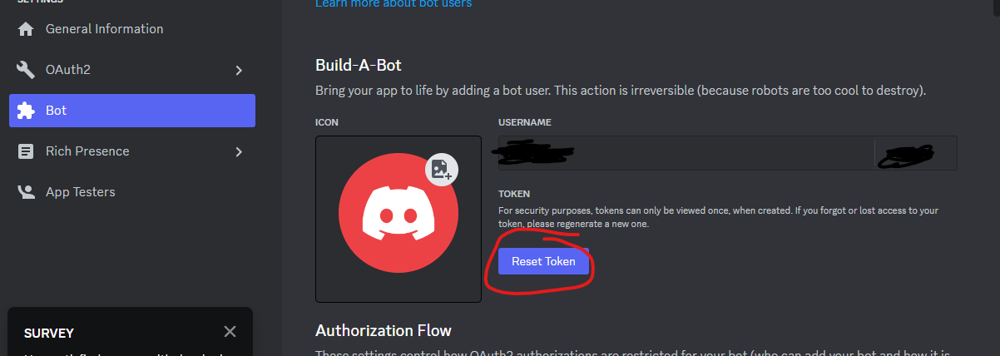
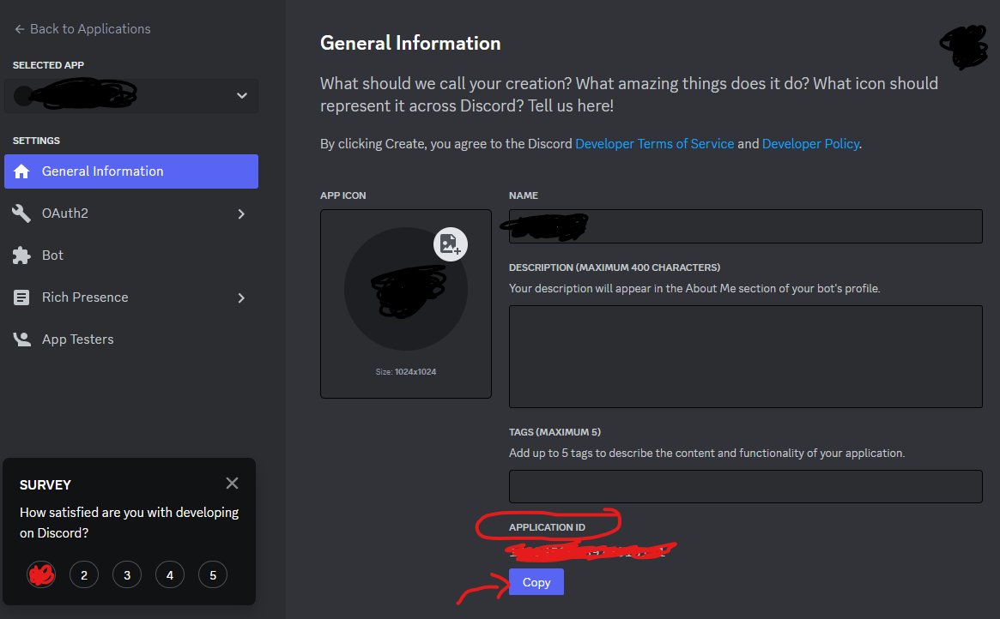

# GC Discord Bot

----

## ToDo
* Documentation folder using `.md` format with examples.
* Get `ping.spec.ts` passing.
* Timezone conversions.
* Schedule meetings across timezones.
* Meeting reminders.
* Meetings allow emotes to accept/decline/request reschedule.

----

## Initialize the project
```bash
npm install
```
1. Create a discord server 
2. Create a discord bot and invite it as per this guide:
https://discordpy.readthedocs.io/en/stable/discord.html
3. Go to your discord [developer portal](https://letmegooglethat.com/?q=discord+developer+portal).
4. Navigate to your newly created application 
5. Rename `.env.example` to `.env`
6. Copy the token and paste it directly after, ex: `TOKEN=89797`
7. Copy the application ID and paste it directly after `CLIENT ID=3289239`


# Building, Running and Deploying... Oh My!

---- 
 
## Run The Bot in Production
```bash
npm start 
```

## Deploy The Bot
*"pushes your changes" to the bot.*
```bash
npm run deploy 
```
## Run Console Tests

```bash
# compile the typescript and start the console test runner
npm test
```

# Development

----

## Create A New Command
Navigate to `/src/commands` and create a new typescript file in the designated folder category.
Example path: `/src/commands/animals/cat.ts`. For reference on how to build a command, refer to  one of the commands in 
`/src/commands`.

## Create A Unit Test

Navigate to `/spec/` and create a unit test file  with the extension `*.spec.ts`, inside the designated folder category.
For example, if you are making a command unit test, keep the spec hierarchy the same as the `src`.
The above example path would look like: `/spec/commands/animals/cat.spec.ts`

>*Note: Every command should have an accompanying test in the spec folder.*
